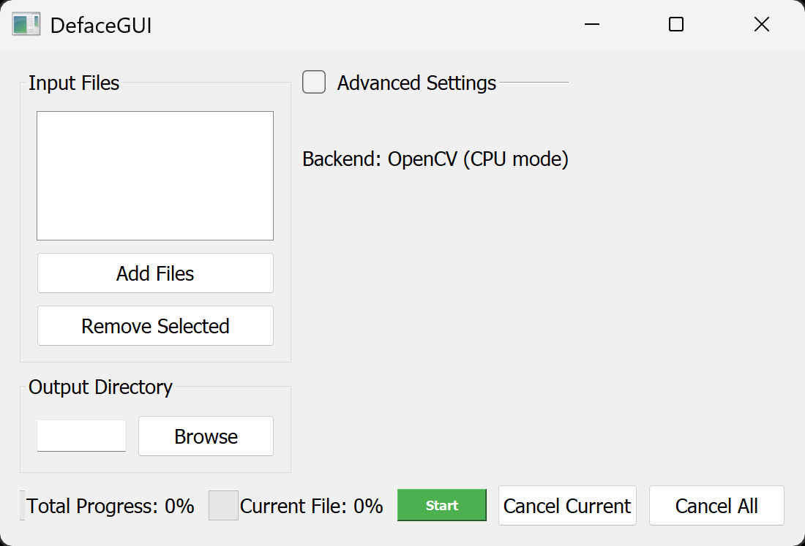

# DefaceGUI

## Intro
This is a GUI for [Deface](https://github.com/ORB-HD/deface).
This app is intented to automaticaly anonymize faces in pictures and videos.

## Known bugs
- Videos with weird fps might be slowed down. Workaround might be to set them to a standard rate.
- OnnxRT (Hardware Acceleration) doesn't work.
- Windows Binary is slow to launch.

## Roadmap
- Relases on Github Releases.
- Binaries for Windows, MacOS and Linux.
- Prettier UI, simpler UX (Hide advanced settings, default output folder, icons to replace English/French strings of text, warn the user for files that might give issues,...)
- Hardware acceleration.
